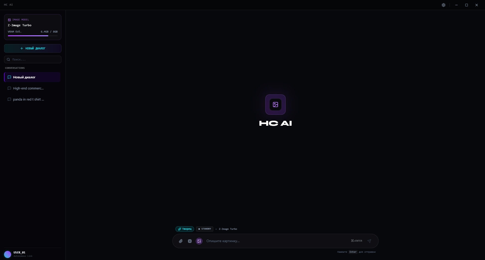
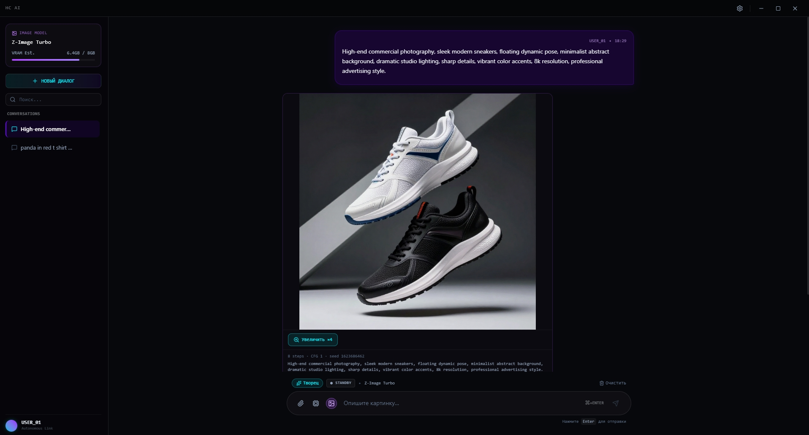

# HC AI - офлайн-агент с локальными моделями

Локальный мультимодальный ИИ-ассистент для Windows: **чат, генерация изображений,  
зрение и апскейл** - всё считается на вашей машине. Без интернета, без облака,  
без API-ключей и подписок.

`Electron 30` + `React 19` + `node-llama-cpp` + `stable-diffusion.cpp (Vulkan)` + `llama.cpp (Vulkan)`





---

## Что умеет

### Текст

- Чат со стримингом токенов, история диалогов, несколько сессий, системные персоны.
- Встроенная LLM - **Qwen3.5 0.8B Q4_K_M** (~507 МБ), гибридная SSM+attention  
  архитектура, 25 блоков. Крутится прямо в главном процессе Electron через  
  `node-llama-cpp`, без Python и без локального HTTP-сервера.
- Подключение **своих GGUF**: инспектор читает заголовок файла (архитектура,  
  квантование, число слоёв, контекст) и добавляет модель в список.
- Внутри LLM же работает служебная логика: перевод промптов RU→EN и  
  классификация намерения `EDIT`/`NEW` для режима изображений.

### Изображения

- Диффузия **Z-Image Turbo** (диффузионный трансформер Q4_K + VAE `ae` +  
  текстовый энкодер Qwen3-4B) через `sd-server` / `sd-cli` на Vulkan.
- 768×768, euler + `sgm_uniform`, distilled guidance 3.5.
- Промпт на русском автоматически переводится в английский встроенной LLM.
- **EDIT-режим**: если в чате уже есть картинка, модель решает - доработать её  
  (`img2img` от предыдущего кадра) или нарисовать новую по описанию.
- **Композитинг «продукт → сцена»**: приложенный предмет не проходит через  
  диффузию. Фон генерируется по описанию, а объект накладывается сверху через  
  canvas - пиксельно, с тенью и сохранением альфы. У непрозрачных фото на  
  однотонном фоне вырезается фон.
- `sd-server` предзагружается при входе в режим изображений, чтобы к первому  
  запросу модели уже были в VRAM.

### Зрение (Vision)

- **Qwen2.5-VL 7B Q4_K_M** + vision-энкодер `mmproj Q8_0` через `llama-server` /  
  `llama-mtmd-cli` на Vulkan. На 8 ГБ VRAM mmproj уходит на CPU  
  (`--no-mmproj-offload`), vision-токены ограничены 1024.
- Быстрые чипы: **Описать** сцену, **OCR** (весь текст с фото),  
  **Объекты**, **Калории** (оценка по фото еды), свой вопрос.
- Альтернативная модель - **Moondream2** F16 (см. `npm run download:moondream`).

### Апскейл

- **Real-ESRGAN ncnn Vulkan**, ×4. Наборы моделей: `realesrgan-x4plus`,  
  `realesrgan-x4plus-anime`, `realesr-animevideov3-x2/x3/x4`,  
  `realesr-general-x4v3`.

### Рантайм

- **Арбитраж VRAM.** Лёгкая LLM (~0.7 ГБ) остаётся в VRAM даже во время Vision:  
  0.7 + 6.0 ГБ умещаются в 8 ГБ, поэтому возврат из Vision в чат мгновенный.  
  Тяжёлые соседи гасятся по очереди, а не все сразу.
- **Префетч в RAM page-cache.** Фоновый процесс прогревает GGUF-файлы в  
  страничный кэш RAM (`prefetch.cjs`), поэтому повторная загрузка идёт из памяти,  
  а не с диска. Замеры - в `BENCHMARKS.md` (холодная загрузка VLM ~35 с →  
  из RAM ~1 с).
- **Телеметрия** в HUD: tok/s, step/s, занятая VRAM, размер контекста.
- Синтезированные звуковые эффекты интерфейса (без внешних файлов).
- Полностью офлайн. Никакой телеметрии, аналитики и сетевых вызовов.

---

## Требования

|         |                                                       |
| ------- | ----------------------------------------------------- |
| ОС      | Windows 10/11 x64                                     |
| Node.js | 20 или новее                                          |
| GPU     | с поддержкой Vulkan (NVIDIA / AMD / Intel Arc)        |
| VRAM    | 8 ГБ (для текста + изображений + Vision)              |
| RAM     | 16 ГБ рекомендуется (используется как кэш моделей)    |
| Диск    | ~13 ГБ под модели + ~2 ГБ под `node_modules` и сборку |

---

## Быстрый старт

```bash
git clone https://github.com/CityStas/hc_local_ai_image
cd hc_local_ai_image
npm install
npm run build
```

Дальше - модели. Одна команда качает всё (~13 ГБ, время зависит от канала):

```bash
npm run download:all
```

Или по частям - минимальный набор для чата это только `download:llm`:

```bash
npm run download:llm         # Qwen3.5 0.8B      ~507 МБ   → чат
npm run download:vulkan       # sd-cli / sd-server ~37 МБ   → движок изображений
npm run download:zimage       # Z-Image Turbo     ~6.1 ГБ   → генерация картинок
npm run download:vlm          # llama-server CLI   ~97 МБ   → движок Vision
npm run download:vlm-model    # Qwen2.5-VL 7B     ~5.2 ГБ   → Vision
npm run download:esrgan       # Real-ESRGAN        ~45 МБ   → апскейл ×4
```

Запуск:

```bash
npm start
```

`npm start` делает `vite build` и поднимает Electron. Модель грузится лениво -  
при первом сообщении, прогресс виден в интерфейсе.

---

## Модели: что, куда и откуда

Скрипты кладут файлы туда, где их ищут движки. Если качаете вручную - имена  
файлов и папки должны совпадать точно, они зашиты в коде.

| Модель                      | Файл                                                                               | Куда                                                  | Размер | Источник                                                                                                                |
| --------------------------- | ---------------------------------------------------------------------------------- | ----------------------------------------------------- | ------ | ----------------------------------------------------------------------------------------------------------------------- |
| Qwen3.5 0.8B (текст)        | `qwen-3.5-0.8b.gguf`                                                               | `node_modules/electron/dist/resources/qwen-3.5-0.8b/` | 507 МБ | [unsloth/Qwen3.5-0.8B-GGUF](https://huggingface.co/unsloth/Qwen3.5-0.8B-GGUF)                                           |
| Z-Image Turbo (диффузия)    | `z_image_turbo-Q4_K.gguf`                                                          | `node_modules/electron/dist/resources/z-image-turbo/` | 3.9 ГБ | [leejet/Z-Image-Turbo-GGUF](https://huggingface.co/leejet/Z-Image-Turbo-GGUF)                                           |
| Z-Image Turbo (VAE)         | `ae.safetensors`                                                                   | там же                                                | 168 МБ | [Tongyi-MAI/Z-Image-Turbo](https://huggingface.co/Tongyi-MAI/Z-Image-Turbo) (`vae/diffusion_pytorch_model.safetensors`) |
| Qwen3-4B (текст-энкодер)    | `Qwen3-4B-Instruct-2507-Q4_K_M.gguf`                                               | там же                                                | 2.5 ГБ | [unsloth/Qwen3-4B-Instruct-2507-GGUF](https://huggingface.co/unsloth/Qwen3-4B-Instruct-2507-GGUF)                       |
| Qwen2.5-VL 7B (Vision)      | `Qwen2.5-VL-7B-Instruct-Q4_K_M.gguf`                                               | `node_modules/electron/dist/resources/Qwen2.5-VL-7B/` | 4.7 ГБ | [ggml-org/Qwen2.5-VL-7B-Instruct-GGUF](https://huggingface.co/ggml-org/Qwen2.5-VL-7B-Instruct-GGUF)                     |
| Qwen2.5-VL (vision-энкодер) | `mmproj-Qwen2.5-VL-7B-Instruct-Q8_0.gguf`                                          | там же                                                | 853 МБ | там же                                                                                                                  |
| Moondream2 (опц. Vision)    | `moondream2-text-model-f16_ct-vicuna.gguf` + `moondream2-mmproj-f16-20250414.gguf` | `node_modules/electron/dist/resources/moondream2/`    | 3.7 ГБ | [ggml-org/moondream2-20250414-GGUF](https://huggingface.co/ggml-org/moondream2-20250414-GGUF)                           |

Движки (бинарники, не модели):

| Движок                                            | Куда                                                            | Источник                                                                                                      |
| ------------------------------------------------- | --------------------------------------------------------------- | ------------------------------------------------------------------------------------------------------------- |
| `sd-cli.exe`, `sd-server.exe` (Vulkan)            | `sd-vulkan/`                                                    | [leejet/stable-diffusion.cpp](https://github.com/leejet/stable-diffusion.cpp/releases) — `master-829-0a565f2` |
| `llama-server.exe`, `llama-mtmd-cli.exe` (Vulkan) | `llama-mtmd/`                                                   | [ggml-org/llama.cpp](https://github.com/ggml-org/llama.cpp/releases) — тег `b10679`                           |
| `realesrgan-ncnn-vulkan.exe` + `models/`          | `node_modules/electron/dist/resources/Real-ESRGAN-ncnn-vulkan/` | [xinntao/Real-ESRGAN](https://github.com/xinntao/Real-ESRGAN/releases/tag/v0.2.5.0) — `v0.2.5.0`              |

> Модели **не хранятся в репозитории** - это ~13 ГБ. `.gitignore` их исключает.  
> Порядок скачивания неважен, важен только итоговый путь.

### Если качаете вручную

Создайте папки и положите файлы с точными именами:

```
node_modules/electron/dist/resources/
├── qwen-3.5-0.8b/qwen-3.5-0.8b.gguf
├── z-image-turbo/
│   ├── z_image_turbo-Q4_K.gguf
│   ├── ae.safetensors
│   └── Qwen3-4B-Instruct-2507-Q4_K_M.gguf
├── Qwen2.5-VL-7B/
│   ├── Qwen2.5-VL-7B-Instruct-Q4_K_M.gguf
│   └── mmproj-Qwen2.5-VL-7B-Instruct-Q8_0.gguf
└── Real-ESRGAN-ncnn-vulkan/
    ├── realesrgan-ncnn-vulkan.exe
    └── models/
```

Движки — в корень проекта:

```
sd-vulkan/sd-cli.exe, sd-vulkan/sd-server.exe
llama-mtmd/llama-server.exe, llama-mtmd/llama-mtmd-cli.exe (+ все .dll рядом)
```

Альтернативный путь - `<корень проекта>/resources/<папка>/`: движки проверяют  
и его тоже. Удобно, если не хотите ничего держать внутри `node_modules`  
(его перезапишет `npm ci`).

---

## Как проверить, что всё встало

```bash
npm start
```

1. В шапке слева должен быть **HC AI**, справа - модель `Qwen3.5 0.8B`.
2. Спросите что-нибудь в чате → пойдёт стриминг токенов, в HUD появятся tok/s.  
   Если модели нет, в ответе будет подсказка `npm run download:llm`.
3. Переключитесь в режим изображений и попросите «кот в шлеме астронавта».  
   Генерация ~15-25 с на `sd-server` (или 60-100 с на фолбэке `sd-cli`).
4. Приложите фото и выберите чип **Описать** / **OCR** - включится Vision.
5. Кнопка **Увеличить ×4** на картинке - апскейл.

Без GPU с Vulkan приложение запустится, но генерация и Vision будут  
непрактично медленными: они рассчитаны на GPU.

---

## Структура проекта

```
main.cjs            главный процесс: IPC, LLM через node-llama-cpp, оркестрация движков
preload.cjs         contextBridge → window.nexus
sdEngine.cjs        изображения: sd-server / sd-cli, img2img, арбитраж VRAM
vlmEngine.cjs       Vision: llama-server / llama-mtmd-cli, ретраи, арбитраж VRAM
upscaleEngine.cjs   Real-ESRGAN ×4
prefetch.cjs        фоновый прогрев GGUF в RAM page-cache
src/                React-интерфейс (App, ChatArea, Sidebar, SettingsDrawer, HUD)
scripts/            загрузка моделей, сборка портативной версии, бенчмарки
BENCHMARKS.md       замеры холодной и «горячей» загрузки
```

---

## Сборка .exe

```bash
npm run dist:exe          # портативный: dist/HC-AI-portable.exe
npm run dist:installer    # установщик NSIS: dist/HC-AI-setup.exe
```

`electron-builder` упаковывает модели из `extraResources`, поэтому папки с  
моделями должны быть на месте до сборки. Портативная версия - один файл,  
распаковал и запустил, права администратора не нужны.

---
